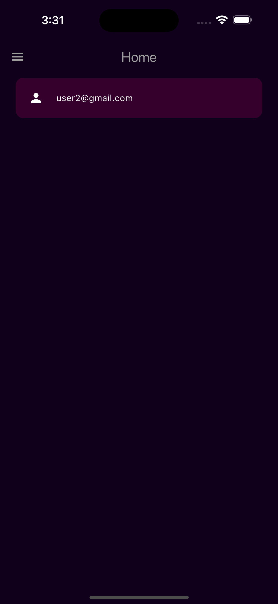

# Convo

**Convo** is a Flutter-based chat application that provides a seamless messaging experience with Firebase integration. The app supports user authentication with Firebase Authentication and Google Sign-In, real-time chat functionality with Firestore, and offers both dark and light modes for a personalized experience. Designed with a modern and minimalistic approach, Convo ensures a clean and intuitive user interface.

## Features

- **User Authentication**: Sign in with email/password or Google account using Firebase Authentication.
- **Real-Time Messaging**: Chat in real-time with Firestore for message storage and synchronization.
- **Dark & Light Modes**: Switch between dark and light themes to suit your preference.
- **Modern Minimal Design**: A clean and intuitive user interface for an optimal chat experience.

## Screenshots

### Light Mode

  
  
  
  
  

### Dark Mode

  
  
  
  
  

### Download Links

- **Android APK**: [Download APK]()

## Dependencies

- [Flutter](https://flutter.dev/) - A framework for building natively compiled applications for mobile, web, and desktop from a single codebase.
- [firebase_core](https://pub.dev/packages/firebase_core) - Core package required for Firebase integration.
- [firebase_auth](https://pub.dev/packages/firebase_auth) - Firebase Authentication package for user management.
- [cloud_firestore](https://pub.dev/packages/cloud_firestore) - Firestore package for real-time data handling.
- [google_sign_in](https://pub.dev/packages/google_sign_in) - Google Sign-In package for authentication.
- [provider](https://pub.dev/packages/provider) - A wrapper around InheritedWidget to manage state efficiently.

## How It Works

**Convo** uses Firebase Authentication to manage user sign-in and Google Sign-In for seamless account access. Firestore handles real-time messaging, ensuring users can send and receive messages instantly. The app's modern design includes both dark and light themes, which users can switch between based on their preference.

## Contributing

Contributions are welcome! If you have suggestions or improvements, feel free to open an issue or submit a pull request.